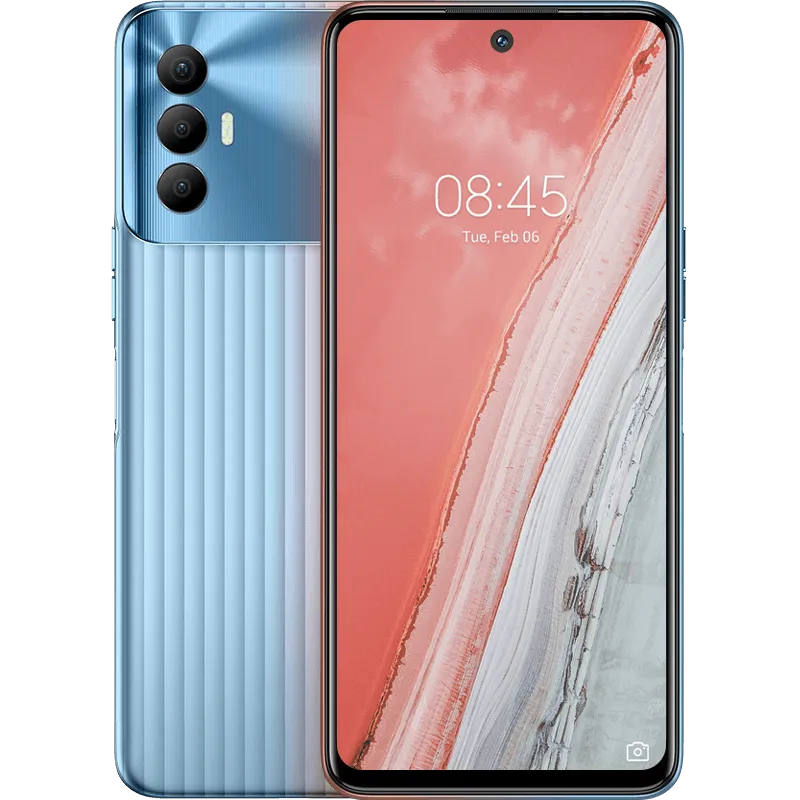

# Twrp Recovery Tree for Tecno Spark 8 Pro KG8 (KG8)

|Basic               |Spec Sheet|
|--                  |--                                                            |
|CPU                 |Octa-core (2×2.0 GHz Cortex-A75 & 6×1.8 GHz Cortex-A55)       |
|Chipset             |MediaTek Helio G85 (12nm)                                     |
|GPU                 |Mali-G52 MC2                                                  |
|Memory              |4GB/6GB RAM                                                   |
|Android Version     |11 (HiOS 7.6)                                                 |
|Storage             |64/128GB                                                      |

Blocking checks
- [X] Correct screen/recovery size
- [X] Working Touch, screen
- [X] Backup to internal/microSD
- [X] Restore from internal/microSD
- [X] reboot to system
- [X] ADB

Medium checks
- [X] update.zip sideload
- [X] UI colors (red/blue inversions)
- [X] Screen goes off and on
- [X] F2FS/EXT4 Support, exFAT/NTFS where supported
- [X] all important partitions listed in mount/backup lists
- [X] backup/restore to/from external (USB-OTG) storage
- [X] backup/restore to/from adb (https://gerrit.omnirom.org/#/c/15943/)
- [X] decrypt /data
- [X] Correct date

Minor checks
- [X] MTP export
- [X] reboot to bootloader
- [X] reboot to recovery
- [X] poweroff
- [X] battery level
- [X] temperature
- [X] encrypted backups
- [X] input devices via USB (USB-OTG) - keyboard, mouse and disks
- [X] USB mass storage export
- [X] set brightness
- [X] vibrate
- [X] screenshot
- [X] partition SD card

